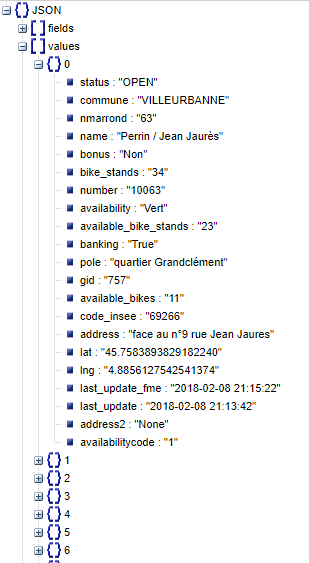

Nos données venant de la platforme  https://data.grandlyon.com open data de lyon:
https://data.grandlyon.com/equipements/station-vflov-disponibilitfs-temps-rfel/

ci-dessous la structure des données remontées :

<table border="0">
  <tr>
    <td>
      
    </td>
  </tr>
  <tr>
    <td align="center">
      Data Structure 
    </td>
  </tr>
</table>
