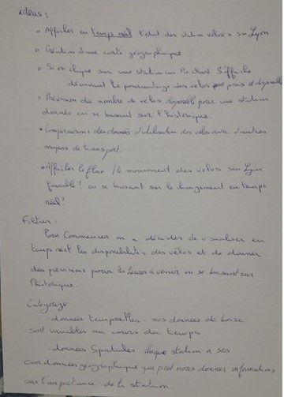
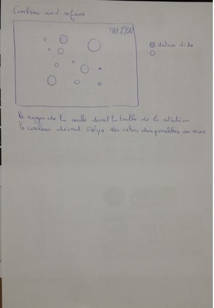
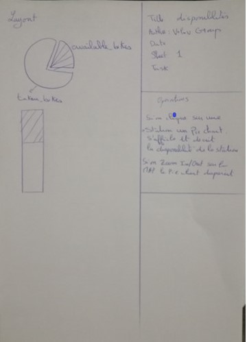
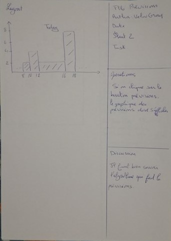
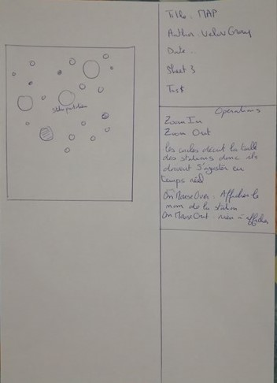

# Proposal

## Brainstorming

Au début de projet c'était difficile de savoir quoi faire avec les données des velo'v de Lyon ! puis aprés avoir 
réflechir nous avons remarqué que l'open data de lyon donne les données sur les stations en temps réel, la premiére idée étatit d'afficher ces données en 
temps réel sans intervention de quelqu' un (données non statiques,nécessite la création d'un script qui télécharge les données réguliérement)
aprés en deuxiéme étape utiliser l'historique (d'une à plusieurs semaines) pour faire des prévisions de disponiblités des velos
il vous suffit de cliquer sur un bouton prévision pour une station donnée à un moment donnée pour savoir la disponibilité prévu de la sation

<table border="0">
  <tr>
    <td>
      
    </td>
  </tr>
</table>

Finally, after filtering these ideas, we decided not to use people's picures, and to use the checkbox to select only some professions.

## Propositions

We roughly had the same ideas when proposing some designs.

<table border="0">
  <tr>
    <td>
      
    </td>
  </tr>
</table>
<table border="0">
  <tr>
    <td>
      
    </td>
  </tr>
</table>
<table border="0">
  <tr>
    <td>
      
    </td>
  </tr>
</table>
<table border="0">
  <tr>
    <td>
      
    </td>
  </tr>
</table>

Aprés une bonne réflexion nous avons remarqué qu'on a besoin d'ecrire un script pour capter le flux des données des
stations velov'v et pour créer une historique de base d'au moins un mois

- informations seront sauvegardés en temps réel pour créer une historique qui serve aux prévisions
