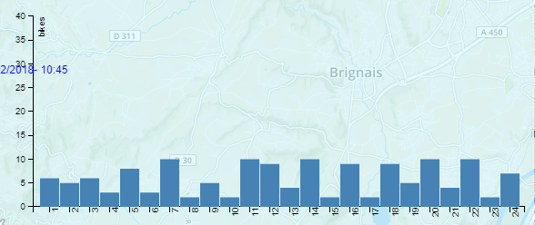

# Projet-Velo-vViz

## INTRODUCTION

This project is carried out by three students of the École Centrale de Lyon during the subject of Data Visualization during the last semester of the university. The members are:

• Chamsedinne
• Salah
• Jon

The general objective of the project is to control the basic knowledge of the Javascript D3 library and create an application with a specific utility using the bases learned during the course.

## VELO'VIZ

The first phase of our project was the choice of data, in our case we went trought a city of Lyon page (https://data.grandlyon.com) where there are several dataset in open source about different elements of the city. Our idea, designed a priori during one of the classes, is that we wanted to use a Google maps and enter information on it and on the other hand we also wanted to enter data in real time.

Finally we chose the dataset of the Lyon bikes which, in addition to containing a lot of information, is updated every minute. This information comes in JSON format and contains more than 360 stations with all the characteristics (address, number of bikes available, neighborhood, identification number, etc ...)

The application therefore aims to serve both the citizen and the city council. The citizen can see the availability of bikes in real time and a prediction for the following hours and the city can draw conclusions from the visually represented history.

<table border="0" align="center">
  <tr>
    <td>
      
    </td>
  </tr>
</table>

## FUNCTIONALITIES

In this section we will explain in detail the different functionalities of the project. For this we will use screen captures and we will discuss how to interact with the screen.

First of all, we want to comment why we have chosen this layout. At first we had thought to divide the information and the map in different "div" like other groups have done. Finally, we thought it would be more visual to introduce the information on the map and allowing the user more flexibility. This way of arranging the elements caused us some problems of overlap but finnaly it allowed us to understand the language and also the DOM html.

### 1. General Information

The general information refers to everything that is displayed when you start the application. On the one hand we see all bike stations represented by a circle. This circle has a different size and color for each one depending on the information. The color is a degraded scale between red and green that indicates if the station is full (green), empty (red). The size of the circle is based on the size of the station, the larger circle being the larger the capacity.

In terms of zooming and scrolling the screen, the operation is the same as that of Google Maps, using the buttons at the top left or the mouse.

On the other hand, when we pass the mouse over a station there is a pop up that appears with basic information, name, address, number of bikes and number of seats. The box appears with an opacity transition and disappears in the same way when we remove the mouse.

Finally, if you click on the station, three new graphics appear. First a Pie Chart that indicates again the availability information but in percentage, and then a box that moves with a transition to the lower right corner that contains more detailed information. Finally there is a prediction chart that will be explained below.

<table border="0" align="center">
  <tr>
    <td>
      
    </td>
  </tr>
</table>

### 2. Velov by neighborhood

This second functionality is more directed to the town Council or to someone who wants to draw conclusions from the given information. This allows us to see the number of bikes in each neighborhood at each moment as it is updated with the movement of the slide bar.

For example, Villeurbane is the largest neighborhood and also the furthest from the center. If we move the slide bar we realize that the number of bikes decreases in the morning and increases in the afternoon. This is due to work schedules, as many people move to the center and then come back for dinner at home. We have checked this with other neighborhoods and on weekends and the trend is even more exaggerated. This can serve as a method of decision when placing new stations or distributing bikes in the city.

The mode of use is by clicking on the "Arrondissement" button on the top left where a table with all the information appears as a transition, as we can see below. Clicking again the box disappears. The information is updated with the time change of the slide Bar.

<table border="0">
  <tr>
    <td>
      
    </td>
  </tr>
</table>

Each of the number is the neighborhood, and VV is: Vaulx en Velin, V: Villeurbane. Here the map of Lyon.

<table border="0" align="center">
  <tr>
    <td>
      
    </td>
  </tr>
</table>

### 3. Real-time script and slide bar
In order to make our project more valuable, we created a real time python script which downloads a new file every 5 minutes from the official site of DataGranDLyon (https://download.data.grandlyon.com/ws/rdata/jcd_jcdecaux.jcdvelov/all.json).
For the moment, we get files for 24 hours (296 files) so that we can have the history of the last 24 hours. Passinf this 24 hours limit, we replace the older file with the first new file of the new day (next 24 hours) and so on...
To ease to interaction of the user with this application, we created a slidebar so that the user can move the the cursor into the position he wants and can read the corresponding date to that position. Each step of the slider counts for 5 minutes. In other words, if we move one step, we load a new file containing the data of the next five minutes.

<table border="0" align="center">
  <tr>
    <td>
      
    </td>
  </tr>
</table>

### 4. Bikes predictions
Velov Bike sharing systems are a means of renting bicycles , rental, and bike return is automated via a network of kiosk locations throughout a city. Using these systems, people are able rent a bike from a one location and return it to a different place on an as-needed basis.

The data generated by these systems makes them attractive and the question that have to be answered how a client can know how many bikes will'be available for an hour h in a station T ?So a prediction system have to be implemented to achieve this goal.the system should be based on the historic of the rent of bikes.
In our work we don"t aim to develop such a data science algorithm we just want to show some fake previsions in this first step then the work can be improved, the main target is visualization.

<table border="0" align="center">
  <tr>
    <td>
      
    </td>
  </tr>
</table>

this figure show us an exemple of prevision of a velo'v station , we can show the previsions of each station when we click on it.

## Improvements

During the presentation session of the project we had a lot of feedback that we are going to put here to see the points that we have improved and those that remain to be done.

Here the feedback (sorry in french):

<table border="0">
  <tr>
    <td>
      
    </td>
  </tr>
</table>

Here we see the positive points, the negatives and the possible improvements to be made.

### List of improvements:

 -Faster transitions: We have modified the speed of the transitions to make them more visual and also the sense of them. It must be said that they were arranged in this way so that the transition could be appreciated and also to try different movements in parallel. Even so we agree that it is not the best way and hence the modifications.
 
 #### Title of the page.
 
Finally we have not put a title since we believe that it takes space for other information, even so we will think how to integrate it in another way.
 
 #### Help Button:
 
 We have introduced a help button to briefly describe the operation of the application. We have not wanted indications overload, if more  information is needed it is better to come here or watch the video on the internet.
 
The button makes a frame appear with a transition and disappears when you click on it again.

<table border="0">
  <tr>
    <td>
      
    </td>
  </tr>
</table>

#### Transitions

Regarding transitions, we have taken into account the feedback given by our colleagues and we have modified the speed and shape of the transitions so that it is more visual and we do not miss the real interest with the movements
 
#### Slider more visible: 
As for the Slider, it wasn't quite visible during the presentation. So, we made sure to add some CSS code in order to make it more visible and so that the user can notice it at first sight.
<table border="0">
  <tr>
    <td>
      
    </td>
  </tr>
</table>

#### Previsions barchart more visible: 
As our colleague have suggested, we have added a transparant background for the previsions barchart to look more readble and clear 
<table border="0">
  <tr>
    <td>
      
    </td>
  </tr>
</table>
 
 

 
## CONCLUSIONS

Firstly we wanted to comment that teamwork has been interesting but it has also been a major challenge. None of us knew the D3 library and therefore the organization at the beginning was complicated. We worked all together during the first sessions to reach the base of our project (map plus points) then we divided into three separate tasks: general information, slide bar and real time and prediction. We did all this in parallel thanks to Github. Finally we made a final session to fix the small bug and finalize the presentation.

As a main conclusion we all agree that the subject has helped us to learn the bases of D3 that we did not know until now. We consider that the subject was well planned and above all, the interaction between teams has allowed everyone to know everyone's projects.

The idea of uploading everything online and having access to other projects is also interesting to be able to take ideas.

The presentation of the projects has been very useful for possible improvements. Involving students through a Google Docs to provide their points of view has allowed everyone to be attentive. The feedback has been very positive.
