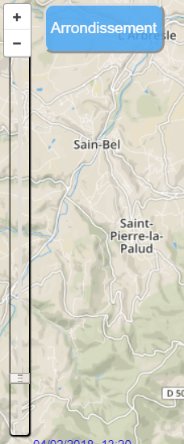

## Presentation Feedback 

Sorry in French

### Points positifs

  • Jolie carte
  
  • Bonne idée d’afficher les graphiques avec la carte en fond (mais peu lisible)
  
  • Bien pensé : les petits graphiques et informations quand on clique sur une station

### Points négatifs

  • Le slider est caché!
  
  #### Réponse: Pendant notre présentation, la résolution du mac qu'on a utilisé était dézoomée. ça devrait bien apparaître si on Zoom. On va augmenter la taille du slider pour l'améliorer quand même.
  
  • Histogrammes peu lisibles:
  
  #### Résponse: On va ajouter un fond transparent derrière l'histogramme pour que ça soit mieux lisible.
  
  • Pas très original => ça existe déjà mais c’est traité ici de manière intéressante (histogramme en particulier).
  
  • Que représente le slider ?:
  
  #### Réponse: Le slider sert à changer le fichier de donnée chargé. Pour la présentation, nous avons utiliser des données collectées pendant 24 heures (le 04/02/2018). En temps réel, le slider va charger le fichier pour date courante quand il est positionné à la fin.

### Recommandation d’améliorations

  • Animations un peu lentes à mon goût.
  
  • Transitions pas forcément claires (le texte d’une part, le fond de l’autre)
  
  • Un bouton “help” serait appréciable

## List of improvements:

 ### Faster transitions: 
 We have modified the speed of the transitions to make them more visual and also the sense of them. It must be said that they were arranged in this way so that the transition could be appreciated and also to try different movements in parallel. Even so we agree that it is not the best way and hence the modifications.
 
 ### Title of the page.
 
Finally we have not put a title since we believe that it takes space for other information, even so we will think how to integrate it in another way.
 
 ### Help Button:
 
 We have introduced a help button to briefly describe the operation of the application. We have not wanted indications overload, if more  information is needed it is better to come here or watch the video on the internet.
 
The button makes a frame appear with a transition and disappears when you click on it again.

<table border="0">
  <tr>
    <td>
      
    </td>
  </tr>
</table>

### Transitions

Regarding transitions, we have taken into account the feedback given by our colleagues and we have modified the speed and shape of the transitions so that it is more visual and we do not miss the real interest with the movements
 
### Slider more visible: 

As for the Slider, it wasn't quite visible during the presentation. So, we made sure to add some CSS code in order to make it more visible and so that the user can notice it at first sight.
<table border="0">
  <tr>
    <td>
      
    </td>
  </tr>
</table>
 
### Prediction chart visualization:

We have introduced a box so that the reading of the prediction chart is easier to read since it was previously confused with the background.

<table border="0">
  <tr>
    <td>
      
    </td>
  </tr>
</table>

## Modified Application

<table border="0">
  <tr>
    <td>
      
    </td>
  </tr>
</table>
